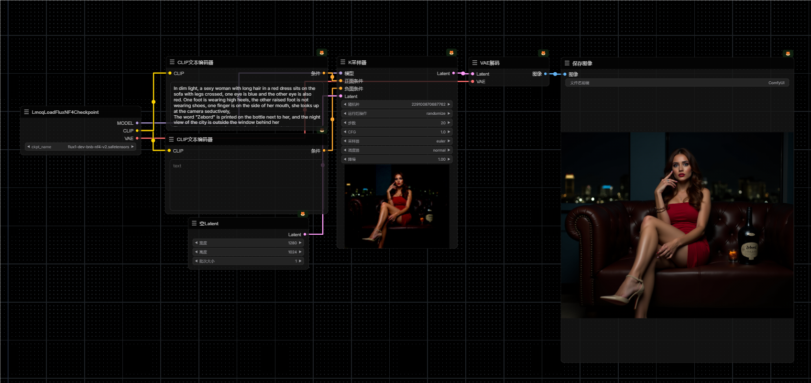
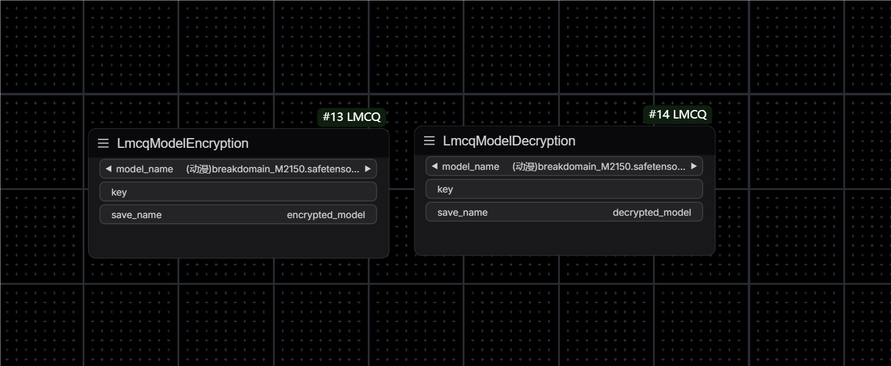

# ComfyUI-LMCQ
**Read this in other languages: [中文](README_CN.md).**

## Introduction

ComfyUI small node toolkit, this toolkit is mainly to update some practical small nodes, to make a contribution to the comfyui ecosystem,
PS: "LMCQ" is the abbreviation of the team name

## image

1. LmcqImageSaver: mainly provides watermarks and metadata information for the generated image files

2. LmcqImageSaverTransit: There is not much difference in function from LmcqImageSaver, the only difference is that the processed image files can be sent to the next node

3. LmcqImageSaverWeb: Add active sending of files and prompt_id to the specified interface address based on LmcqImageSaver (the purpose of its design is to avoid WS to maintain a large number of long connection requests)

~~~
Function details

filename_prefix:        File name prefix
format:                 File format, currently supports 'png, jpg, webp'
quality:                File compression rate, the smaller the value, the higher the compression rate, the smaller the corresponding file size, if you want to use this function, please select jpg format in the file format
apply_watermark:        Whether to enable the watermark function
watermark_text:         Watermark text content
watermark_size:         Watermark size, default 15, maximum 70
watermark_position:     The position of the watermark in the image
enhance_brightness:     Set the brightness of the image, the lower the value, the darker the image
enhance_contrast:       Set the color saturation of the image, the lower the value, the lower the saturation
save_metadata:          Whether to save the workflow information behind the image
enable_api_call:        Whether to enable the interface request, if enabled, the prompt_id in the file and api will be sent to the corresponding interface after the workflow is completed
api_url:                The requested interface address

~~~
## flux

1. Since lllyasviel updated the NF4 version of flux, but there is no corresponding node in comfyui to load its model, the conventional checkpointLoader cannot adapt to the model, so this node is designed to facilitate the use of the model, and the usage is the same as the conventional checkpointLoader

## Update log 2024-08-20

Image series features added
~~~
watermark_type: watermark type, default text, options: text, image

watermark_image: connect the image you want to use as a watermark

watermark_opacity: watermark transparency, default 0.5, maximum value 1
~~~

## Update log 2024-11-11

### Utils

1. LmcqInputValidator: Used to validate input value types, can determine whether the input is a pure number or a string

~~~
Function details

input_text:     Input text to be validated
check_type:     Validation type, options:
               - is_digit: Check if it's a pure number
               - is_string: Check if it's a string (any input that's not a pure number is considered a string)
~~~

## Update log 2024-12-12 (Model encryption!!!)

### Model encryption and decryption

### LmcqModelEncryption
~~~
Function explanation

model_name: Select the model you want to encrypt
key       : Encryption key (custom, key password for subsequent decryption)
save_name : Encrypted model name
~~~
After filling in, click Execute. Two files will be generated in your model folder, a model and a file with the suffix .meta. The meta file records your encryption signature and version information. Remember to put the two files in the same directory, otherwise the encrypted model cannot be decrypted

### LmcqModelDecryption
~~~
Function explanation

model_name: Select the model you want to decrypt
key       : Encryption key (enter the key information set during encryption)
save_name : Decrypted model name
~~~

## Update Log 2024-12-18 (Workflow Protection!)

### Workflow Encryption/Decryption

### LmcqWorkflowEncryption
~~~
Function Details:
action:        Choose to encrypt or decrypt workflow
password:      Password for encryption/decryption
workflow_file: Select the workflow file to process (from root or plugin workflows folder)
save_name:     Name for the saved file
~~~

This node allows you to encrypt your workflow files with a password, preventing unauthorized access. The encrypted workflow can only be loaded after decryption with the correct password.

Usage:
1. Save your workflow file to either:
   - ComfyUI root/workflows folder (shown as "root/filename")
   - Plugin's workflows folder (shown as "plugin/filename")
2. Use 'encrypt' action to create an encrypted version
3. Share the encrypted workflow file
4. Recipients must use 'decrypt' action with the correct password to use the workflow

Note: The encrypted/decrypted file will be saved in the same folder as the source file.

## (LoRA Protection!)

### LoRA Model Encryption/Decryption

### LmcqLoraEncryption
~~~
Function Details:
lora_name:  Select the LoRA model to encrypt
key:        Encryption key (for later decryption)
save_name:  Name for the encrypted model
~~~
After execution, two files will be generated in your loras/encrypted folder: an encrypted model and a .meta file. The meta file contains encryption signature and version information. Both files must be kept together for successful decryption.

### LmcqLoraDecryption
~~~
Function Details:
lora_name:  Select the encrypted LoRA model
key:        Decryption key (must match encryption key)
save_name:  Name for the decrypted model
~~~
The decrypted LoRA will be saved in the loras/decrypted folder.

## Update Log 2024-12-21 (Runtime Protection System!)

### Machine Code & Runtime Protection

### LmcqGetMachineCode
A utility node that generates a unique machine code based on hardware and system information. This code is used for authorization in the runtime protection system.

### Runtime Model Protection
~~~
LmcqRuntimeModelEncryption:
- model_name:    Select the model to encrypt
- key:          Encryption key
- save_name:    Name for the encrypted model
- machine_codes: List of authorized machine codes (one per line)

LmcqRuntimeModelDecryption:
- model_name:    Select the encrypted model
- key:          Decryption key
~~~
Provides real-time model encryption/decryption with machine-specific authorization. Models can only be loaded on authorized machines.
PS: The encrypted model is loaded in memory, so the complete model will not be saved locally. It can only be used in the workflow to protect the complete model from being spread to the greatest extent (only LmcqRuntimeModelDecryption can be used to load the encrypted model, and the rest are invalid)

### Runtime LoRA Protection
~~~
LmcqRuntimeLoraEncryption:
- lora_name:     Select the LoRA to encrypt
- key:          Encryption key
- save_name:    Name for the encrypted LoRA
- machine_codes: List of authorized machine codes

LmcqRuntimeLoraDecryption:
- model:         Input model
- clip:         Input CLIP
- lora_name:    Select the encrypted LoRA
- key:          Decryption key
- strength_model: LoRA strength for model
- strength_clip:  LoRA strength for CLIP
~~~
Secure LoRA models with machine-specific authorization and real-time loading.
PS: The encrypted model is loaded in memory, so the complete model will not be saved locally. It can only be used in the workflow to protect the complete model from being spread to the greatest extent (only LmcqRuntimeLoraDecryption can be used to load the encrypted model, and the rest are invalid)
### Runtime Workflow Protection
~~~
LmcqRuntimeWorkflowEncryption:
- workflow_file: Select workflow to encrypt
- key:          Encryption key
- save_name:    Name for encrypted workflow (.lcwf)
- machine_codes: List of authorized machine codes

LmcqRuntimeWorkflowDecryption:
- workflow_file: Select encrypted workflow
- key:          Decryption key
- save_name:    Name for decrypted workflow
~~~
Protects workflows with machine-specific authorization. Encrypted workflows are saved in .lcwf format and can only be decrypted on authorized machines.

Note: The runtime protection system ensures that protected assets can only be used on specifically authorized machines, providing stronger security than password-only protection.

## Contribute

zebord