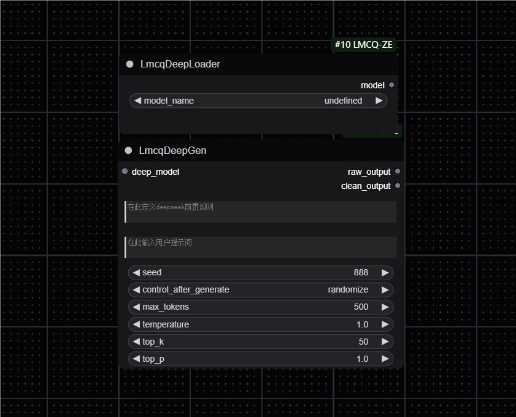
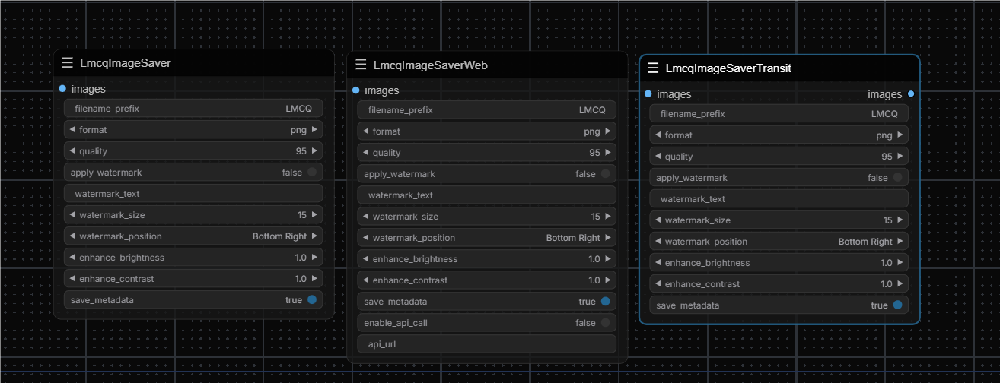
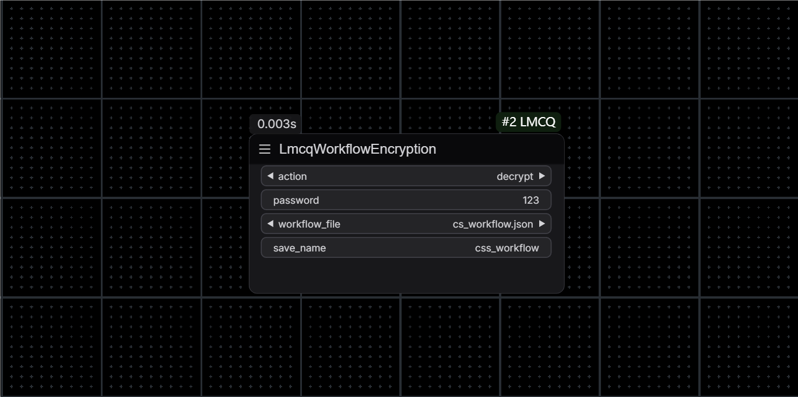
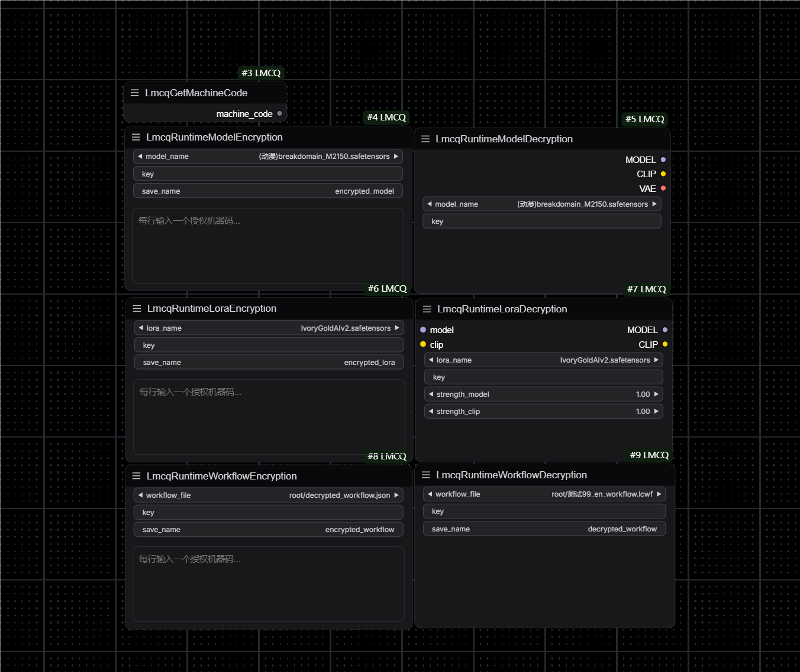

# ComfyUI-LMCQ
**切换英文版: [English](README.md)**
## 介绍

ComfyUI小节点工具包，本工具包主要是更新一些实用的小节点，为comfyui生态做一份贡献，
PS："LMCQ"是团队名称的简写

## 加密/分发版用户必读：重要运行时配置说明

本 README 描述了 ComfyUI-LMCQ 插件的功能，其核心逻辑已通过高级编译技术进行了安全保护。

**关键的运行时设置步骤：**

在此受保护的版本中，`runtime` 目录采用了新的结构。它包含了对应不同 Python 版本的子目录（例如，`310` 对应 Python 3.10，`311` 对应 Python 3.11 等），每个子目录中存放着针对该特定 Python 环境编译的核心文件。

为了确保插件在您的本地 ComfyUI 环境中正常工作，您在下载或克隆本项目后 **必须** 执行以下步骤：

1.  **确定您本地 ComfyUI 实例所使用的 Python 版本**（例如 Python 3.10, 3.11, 3.12, 3.13）。
2.  进入本插件目录 (`ComfyUI-LMCQ`) 内的 `runtime` 目录。
3.  您会看到以 Python 版本号命名的子文件夹（例如 `310`, `311`, `312`, `313`）。**找到与您的 Python 版本匹配的子文件夹。**
4.  将该特定版本子文件夹内（例如 `runtime/310/` 内）的 **所有文件移动** 到 `runtime` 目录的根目录下（即，它们应该成为 `runtime/some_file.pyd` 等）。
5.  移动完毕后，**删除 `runtime` 目录中所有带版本号的子文件夹**（例如 `310`, `311`, `312`, `313`）及其内部残留的任何文件。

**例如：** 如果您的 ComfyUI 使用的是 Python 3.11：
   - 进入 `ComfyUI-LMCQ/runtime/311/` 目录。
   - 将 `ComfyUI-LMCQ/runtime/311/` 内的所有文件移动到 `ComfyUI-LMCQ/runtime/` 目录下。
   - 删除 `ComfyUI-LMCQ/runtime/` 目录下的 `310/`、`311/`、`312/` 和 `313/` 文件夹（以及其他任何存在的版本号文件夹）。

未能正确执行这些步骤将导致 ComfyUI 加载插件时出错，因为它无法为您的 Python 环境找到必需的已编译运行时文件。

## 更新日志 2025年5月8日 (加密节点组 & 核心安全增强！)

我们激动地宣布 ComfyUI-LMCQ 在增强功能和核心安全方面的两项重大进展：

### 1. 加密节点组功能 (云安全加固)

隆重推出 **Lmcq 加密节点组** (LmcqGroupNode)！这个强大的新节点允许您将一组节点（一个子图）封装成一个单一的、安全加密的单元，并通过我们的云平台进行管理。

 <!-- TODO: 后续添加节点组功能的相关截图 -->

**主要特性**:
- **保护复杂工作流**: 将复杂的节点组合或专有逻辑安全地打包成一个加密模块。
- **云端安全保障**: 加密密钥和授权通过我们安全的云API进行管理，确保只有经过验证的用户才能访问内部子图。
- **用户友好的操作**: 一旦授权，加密节点组的功能与标准 ComfyUI 节点组类似，其内部复杂性始终受到保护。
- **安全访问**: 使用用户定义的`workflow_identifier` (工作流标识符) 和 `password` (密码) 与云服务进行身份验证，以启用解密。
- **可选的机器绑定**: 为了增加一层额外的安全性，节点组可以绑定到特定的机器码，这与 Lmcq其他认证节点提供的保护机制一致。

**工作原理 (概念性)**:
1. 在 ComfyUI 中设计的子图被准备进行加密。
2. 该子图连同一个选定的密码、一个唯一的标识符和可选的机器码，被注册到 Lmcq 云服务。
3. 云服务提供该子图的加密表示形式。
4. 在 ComfyUI 中，`LmcqGroupNode` 使用此加密数据、标识符和密码，在执行时向云服务请求解密。
5. 如果身份验证和授权成功，该子图将在内存中解密并按预期运行。

此功能使创作者能够以增强的控制和安全性共享高级功能或预配置的设置，防止内部工作流逻辑的直接暴露。

### 2. 通过高级编译技术增强核心安全性

ComfyUI-LMCQ 的核心运行时模块现在已通过显著的安全升级。我们已过渡到一种**先进的编译技术**，该技术将我们的 Python 源代码转换为更安全的二进制格式。

**主要改进**:
- **极大增强的源代码保护**: 与以前的保护方法相比，新的编译格式对逆向工程和反编译具有显著更强的抵抗力。这有力地保护了我们核心逻辑中嵌入的知识产权。
- **增强的插件完整性**: 此安全增强有助于为所有用户提供一个更安全、更值得信赖的插件。
- **优化的分发**: 插件的发行版现在包含这些安全编译的模块，确保最终用户接收到的是受保护的代码。

我们保护代码库方式的这一根本性改进，确保了 ComfyUI-LMCQ 在继续提供创新功能的同时，也高度重视安全和知识产权保护。最终用户将通过一个更安全的插件环境体验到这些好处。

---

## 更新日志 2025年4月23日 (代码保护节点！)

推出全新的代码保护节点，旨在加密您的 ComfyUI 自定义节点的 Python 源代码文件：

 <!-- 占位符：后续添加截图 -->

### 代码保护节点
- **LmcqCodeEncryption**: 加密一个 `.py` 文件，生成一个 `.pye` 加密文件和一个可选的加载器桩 (`.py`)。
- **LmcqCodeDecryptionLoader**: 使用加载器桩加载并执行加密的 `.pye` 文件。

### 主要特性
- **保护您的逻辑**: 加密您的自定义节点源代码，防止被轻易逆向工程或未经授权的修改。
- **加密级别**: 可在"基础"、"高级"和"极致"加密级别之间选择，提供不同程度的安全性。
- **可选混淆**: 应用简单的变量名混淆，增加额外的保护层（注意：可能会影响复杂代码，请谨慎使用）。
- **自定义导入钩子**: 生成一个加载器桩（与原始文件同名的 `.py` 文件），当模块被导入时，它会自动处理解密和加载过程。
- **保留原始文件选项**: 决定加密后是否保留原始的 `.py` 文件。

### 工作原理
1. 使用 `LmcqCodeEncryption` 选择您的 `.py` 文件，选择加密级别，并可选择启用混淆和加载器桩生成。
2. 该节点输出一个加密的 `.pye` 文件，并可能用加载器桩覆盖原始的 `.py` 文件（如果 `add_custom_import_hook` 为 True 且 `keep_original` 为 False）。
3. 当 Python 导入加载器桩 `.py` 文件时，它会自动查找对应的 `.pye` 文件，使用嵌入的密钥对其进行解密，并在内存中执行代码。

该系统允许您以受保护的格式分发您的自定义节点，同时保持最终用户的易用性。

## 更新日志 2025-03-04 (认证服务器加密系统！)

我们推出了全新的认证服务器加密系统，为模型创作者提供更强大和灵活的保护机制：

### 认证服务器加密系统
- ✓ 基于HTTP的认证服务器验证
- ✓ 动态密钥分发机制
- ✓ 实时授权验证
- ✓ 在线管理平台

### 主要特性
1. **模型使用管理**
   - 动态调整授权机器码列表
   - 灵活设置模型使用期限
   - 自定义模型可用次数
   - 实时查看使用统计

2. **在线管理平台**
   - 网址：http://1.95.3.202/
   - 一键管理所有加密模型
   - 实时监控模型使用情况
   - 快速更新授权配置

3. **支持模型类型**
   - Checkpoint模型加密 (LmcqAuthModelEncryption/LmcqAuthModelDecryption)
   - LoRA模型加密 (LmcqAuthLoraEncryption/LmcqAuthLoraDecryption)
   - 工作流加密 (LmcqAuthWorkflowEncryption/LmcqAuthWorkflowDecryption)
   - Flux模型加密 (LmcqAuthFluxEncryption/LmcqAuthFluxDecryption)

4. **安全特性**
   - 实时机器码验证
   - 时间戳防重放攻击
   - 加密通信保护

### 使用流程
1. 在认证服务器注册账号
2. 获取创作者密钥(auth_key)和密钥密文(auth_secret)
3. 将密钥信息配置到auth_key.json
4. 使用对应的加密节点进行模型加密
5. 登录管理平台进行权限管理

### 注意事项
- 请妥善保管auth_key.json中的密钥信息
- 建议定期更换密钥提升安全性
- 及时通过管理平台更新授权信息

## 更新日志 2025-02-10 (DeepSeek模型集成！)

### Deepseek系列节点
  <!-- 需要您补充截图后替换实际文件名 -->

#### LmcqDeepLoader
~~~text
功能详解：
model_name: 选择本地下载的Deepseek大语言模型（默认读取/models/deepseek/目录下的模型）
~~~
模型下载地址:
1B 模型: https://huggingface.co/deepseek-ai/DeepSeek-R1-Distill-Qwen-1B/tree/main
7B 模型: https://huggingface.co/deepseek-ai/DeepSeek-R1-Distill-Qwen-7B/tree/main
14B 模型: https://huggingface.co/deepseek-ai/DeepSeek-R1-Distill-Qwen-14B/tree/main
32B 模型: https://huggingface.co/deepseek-ai/DeepSeek-R1-Distill-Qwen-32B/tree/main
70B 模型: https://huggingface.co/deepseek-ai/DeepSeek-R1-Distill-Llama-70B/tree/main

每个模型请下载对应的所有文件，按照其名称作为文件夹名称，将所有文件放进该文件夹，并放在/models/deepseek/目录下：如/models/deepseek/DeepSeek-R1-Distill-Qwen-7B/

#### LmcqDeepGen
~~~text
功能详解：
system_prompt:   系统级指令设定(定义模型行为规则)
user_prompt:     用户输入提示词

seed:            随机种子(0-9999999)
max_tokens:      最大生成token数(0-无限制)
temperature:     生成温度(0-2，值越高越随机)
top_k:           候选词数量(0-100)
top_p:           核采样概率(0-1)

输出端口：
raw_output:  包含思考过程的原始输出
clean_output: 清理后的纯净输出
~~~

特性说明：
1. 支持通过system_prompt设置模型行为规则
2. 自动清理模型输出的<think>思考过程</think>标签
3. 提供双输出端口满足不同场景需求
4. 完整支持Deepseek模型参数体系
~~~

## 更新日志 2025-01-08 （白盒加密与安全增强！）

我们实现了一套复杂的白盒加密系统并增强了安全机制：

### 白盒加密
- 动态T-box和S-box生成
- 复杂的密钥扩展算法
- 多轮变换机制
- 内存保护机制

### 增强的安全特性
- ✓ 安全的密钥存储
- ✓ 反调试保护
- ✓ 内存篡改检测
- ✓ 运行时完整性验证

新的白盒加密实现使得即使获得完整代码也极难提取加密密钥。结合我们现有的多层保护方案，为您的模型和工作流提供了最先进的安全保护。

## 更新日志 2024-12-29 （运行时保护系统套装核心代码引入多层保护机制！）
由于之前版本加解密节点代码明文显示，容易被逆向工程师轻松破解从而无法保障模型的安全保障问题，现在核心加解密代码统一引入多层保护机制

- 多层保护方案
   - AST级别代码混淆
   - PyArmor基础加密
   - 变量名/函数名混淆
   - 干扰代码注入
   - 字符串混淆

现在项目中安全节点代码全部经过多层保护方案高强度加密，很大程度地抬高了逆向工程师的破解难度，从而保障了模型的安全保障问题

## Image

1. LmcqImageSaver：主要对生成出来的图像文件提供水印和是否保存元数据信息功能
2. LmcqImageSaverTransit：功能上与LmcqImageSaver没有太大差别，唯一的区别就是可以将处理过后的图像文件发送到下一个节点
3. LmcqImageSaverWeb：在LmcqImageSaver基础上添加主动发送文件及prompt_id到指定接口地址（设计它的目的是为了不用WS去保持大量的长连接请求）

~~~
功能详解

filename_prefix：    文件名前缀
format：             文件格式，目前支持'png、jpg、webp'三种
quality：            文件压缩率，数值越小，压缩率越高，对应的文件大小越小，如果要使用该功能请在文件格式中选择jpg格式
apply_watermark：    是否开启水印功能
watermark_text：     水印文本内容
watermark_size：     水印大小，默认15，最高70
watermark_position： 水印在图片当中的位置
enhance_brightness： 设置图片的明暗程度，数值越低，图片越暗
enhance_contrast：   设置图片的色彩饱和程度，数值越低，饱和度越低
save_metadata：      是否保存图片背后的工作流信息
enable_api_call：    是否开启接口请求，若开启，则会在工作流完成之后将文件及api当中的prompt_id发送到对应接口
api_url：            请求的接口地址

~~~
## flux

1. 由于lllyasviel大佬更新了flux的NF4版本，但comfyui当中没有对应的加载其模型的节点，常规的checkpointLoader无法适配该模型，所以设计该节点用于方便模型使用,使用方式跟常规checkpointLoader一样

## 更新日志 2024-08-20

Image系列功能新增
~~~
watermark_type：水印类型，默认文本，可选项：文本、图片

watermark_image：连接你要用于作为水印的图片

watermark_opacity：水印透明度，默认0.5，最大值为1
~~~

## 更新日志 2024-11-11
### Utils

1. LmcqInputValidator：用于验证输入值的类型，可以判断输入是纯数字还是字符串

~~~
功能详解

input_text：    需要验证的输入文本
check_type：    验证类型，可选项：
               - is_digit：判断是否为纯数字
               - is_string：判断是否为字符串（任何非纯数字的输入都被视为字符串）
~~~

## 更新日志 2024-12-12 （模型加密！！！）

### 模型加解密

### LmcqModelEncryption
~~~
功能讲解
model_name：选择你要加密的模型
key       ：加密密钥（自定义，用于后续解密的关键密码）
save_name ：加密后的模型名称
~~~
填写完毕之后点击执行，会在你的模型文件夹下生成两个文件，一个模型和一个后缀名为.meta的文件，meta文件记录你的加密签名及版本信息，记住一定要将两个文件放在同一个目录，否则加密后的模型无法解密

### LmcqModelDecryption
~~~
功能讲解
model_name：选择你要解密的模型
key       ：加密密钥（输入加密时设置的密钥信息）
save_name ：解密后的模型名称
~~~

## 更新日志 2024-12-18 （工作流保护！）

### 工作流加解密

### LmcqWorkflowEncryption
~~~
功能详解：
action:        选择加密或解密操作
password:      加解密密码
workflow_file: 选择要处理的工作流文件（可从根目录或插件的 workflows 文件夹中选择）
save_name:     保存文件的名称
~~~

该节点允许你对工作流文件进行加密保护，防止未经授权的访问。加密后的工作流文件需要使用正确的密码解密后才能使用。

使用方法：
1. 将工作流文件保存到以下任一位置：
   - ComfyUI根目录的 workflows 文件夹（显示为 "root/文件名"）
   - 插件目录的 workflows 文件夹（显示为 "plugin/文件名"）
2. 使用 encrypt 操作创建加密版本
3. 分享加密后的工作流文件
4. 接收者需要使用 decrypt 操作并输入正确的密码才能使用该工作流

注意：加密/解密后的文件会保存在源文件所在的同一文件夹中。

## （LoRA加密！）

### LoRA模型加解密

### LmcqLoraEncryption
~~~
功能讲解：
lora_name：选择要加密的LoRA模型
key：      加密密钥（自定义，用于后续解密的关键密码）
save_name：加密后的模型名称
~~~
执行后会在 loras/encrypted 文件夹下生成两个文件：加密后的模型和一个后缀为 .meta 的文件。meta 文件记录了加密签名和版本信息，这两个文件必须放在同一目录才能成功解密。

### LmcqLoraDecryption
~~~
功能讲解：
lora_name：选择要解密的LoRA模型
key：      加密密钥（输入加密时设置的密钥信息）
save_name：解密后的模型名称
~~~
解密后的LoRA模型会保存在 loras/decrypted 文件夹中。

## 更新日志 2024-12-21 （运行时保护系统！）

### 机器码与运行时保护

### LmcqGetMachineCode
用于生成基于硬件和系统信息的唯一机器码的工具节点。此机器码用于运行时保护系统中的授权验证。

### 运行时模型保护
~~~
LmcqRuntimeModelEncryption（运行时模型加密）:
- model_name:    选择要加密的模型
- key:          加密密钥
- save_name:    加密后的模型名称
- machine_codes: 授权机器码列表（每行一个）

LmcqRuntimeModelDecryption（运行时模型解密）:
- model_name:    选择加密的模型
- key:          解密密钥
~~~
提供实时模型加解密和特定机器授权功能。模型只能在授权的机器上加载。
PS: 加密模型在内存中进行加载，所以不会在本地保存完整模型，只能用于工作流当中，最大程度保护完整模型不被传播(只能使用LmcqRuntimeModelDecryption去加载加密模型，其余无效)

### 运行时LoRA保护
~~~
LmcqRuntimeLoraEncryption（运行时LoRA加密）:
- lora_name:     选择要加密的LoRA
- key:          加密密钥
- save_name:    加密后的LoRA名称
- machine_codes: 授权机器码列表

LmcqRuntimeLoraDecryption（运行时LoRA解密）:
- model:         输入模型
- clip:         输入CLIP
- lora_name:    选择加密的LoRA
- key:          解密密钥
- strength_model: 模型的LoRA强度
- strength_clip:  CLIP的LoRA强度
~~~
使用机器特定授权和实时加载功能来保护LoRA模型。
PS: 加密模型在内存中进行加载，所以不会在本地保存完整模型，只能用于工作流当中，最大程度保护完整模型不被传播(只能使用LmcqRuntimeLoraDecryption去加载加密模型，其余无效)

### 运行时工作流保护
~~~
LmcqRuntimeWorkflowEncryption（运行时工作流加密）:
- workflow_file: 选择要加密的工作流
- key:          加密密钥
- save_name:    加密后的工作流名称（.lcwf格式）
- machine_codes: 授权机器码列表

LmcqRuntimeWorkflowDecryption（运行时工作流解密）:
- workflow_file: 选择加密的工作流
- key:          解密密钥
- save_name:    解密后的工作流名称
~~~
通过机器特定授权保护工作流。加密的工作流以.lcwf格式保存，只能在授权机器上解密。

注意：运行时保护系统确保受保护的资源只能在特定授权的机器上使用，比单纯的密码保护提供更强的安全性。

## 2024-12-29 TODO（接下来的计划）

我们现在正在筹备的工作：
   研发一套完整的认证服务系统，专用于更高效提升ComfyUi安全节点功能安全性，所有节点的核心功能逻辑将由第三方认证服务系统提供，最大程度保障模型、工作流安全（并会提供更花样的玩法如：加密模型使用次数限制、加密模型使用时间限制、加密模型使用设备限制等），为创作者提供更安全的创作环境，敬请期待！！！

## 参与贡献!

Zebord